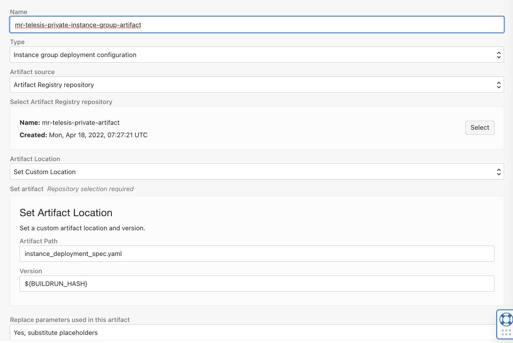
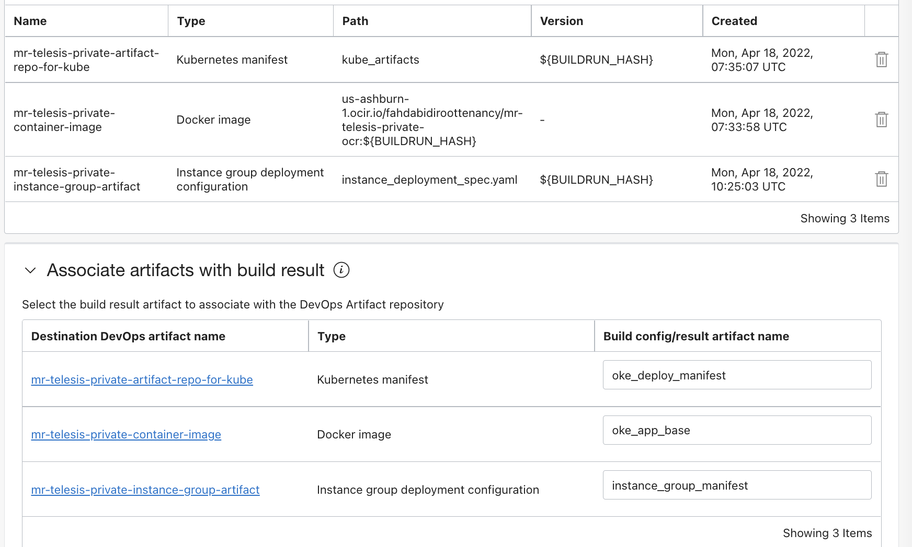
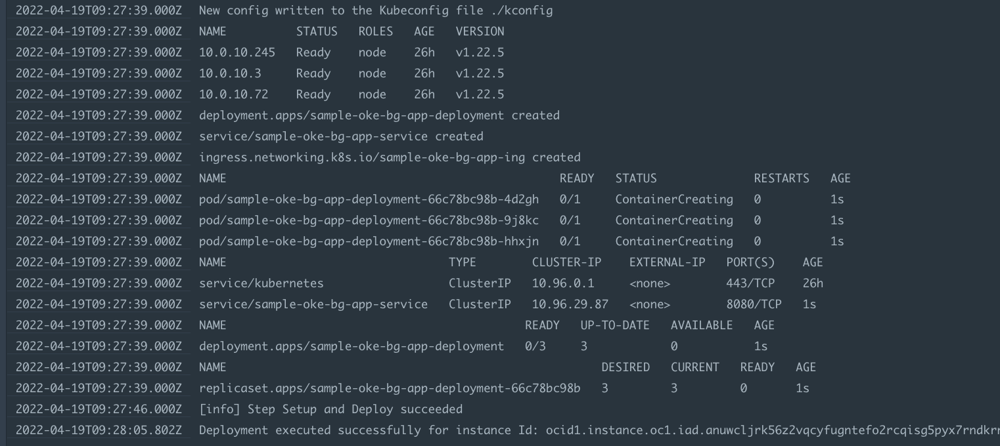

Deploy kubernetes using OCI Devops and Instances group

----------

Its a specific sample execution to cover 

- OCI Devops with Instance group deployment.
- While the instance is acted as a jump host towards a customer kubernetes cluster.


Target Audience : OCI Devops Experienced

Basic instructions 

- Create a dynamic group with below rules for devops usages.

```
ALL {resource.type = 'devopsbuildpipeline', resource.compartment.id = 'ocid1.compartment.oc1..xx'}	
ALL {resource.type = 'devopsdeploypipeline', resource.compartment.id = 'ocid1.compartment.oc1..xx'}	
ALL {resource.type = 'devopsrepository', resource.compartment.id = 'ocid1.compartment.oc1..xx'}	
All {instance.compartment.id = 'ocid1.compartment.oc1..xx'}	
ALL {resource.type = 'devopsconnection', resource.compartment.id = 'ocid1.compartment.oc1..xx'}
```

- Create a policy with below statements for devops usages.


```
Allow dynamic-group mr-telesis-private-dg-devops-instances to manage repos in compartment <compartment_name>
Allow dynamic-group mr-telesis-private-dg-devops-instances to manage repos in compartment mr-prod-compartment
Allow dynamic-group mr-telesis-private-dg-devops-instances to read secret-family in compartment <compartment_name>
Allow dynamic-group mr-telesis-private-dg-devops-instances to read secret-family in compartment mr-prod-compartment
Allow dynamic-group mr-telesis-private-dg-devops-instances to manage devops-family in compartment <compartment_name>
Allow dynamic-group mr-telesis-private-dg-devops-instances to manage devops-family in compartment mr-prod-compartment
Allow dynamic-group mr-telesis-private-dg-devops-instances to manage generic-artifacts in compartment <compartment_name>
llow dynamic-group mr-telesis-private-dg-devops-instances to manage generic-artifacts in compartment mr-prod-compartment
Allow dynamic-group mr-telesis-private-dg-devops-instances to use ons-topics in compartment <compartment_name>
Allow dynamic-group mr-telesis-private-dg-devops-instances to use ons-topics in compartment mr-prod-compartment
Allow dynamic-group mr-telesis-private-dg-devops-instances to use instance-agent-command-execution-family in compartment <compartment_name>
Allow dynamic-group mr-telesis-private-dg-devops-instances to use instance-agent-command-execution-family in compartment mr-prod-compartment
Allow dynamic-group mr-telesis-private-dg-devops-instances to read generic-artifacts in compartment <compartment_name>
Allow dynamic-group mr-telesis-private-dg-devops-instances to read generic-artifacts in compartment mr-prod-compartment
Allow dynamic-group  to read all-artifacts in compartment mr-prod-compartment

```

- Create an OCI artifact registry - https://docs.oracle.com/en-us/iaas/Content/artifacts/home.htm


- Create an OCI Container registry - https://docs.oracle.com/en-us/iaas/Content/Registry/home.htm


- Create an OCI notiication topic - https://docs.oracle.com/en-us/iaas/Content/Notification/home.htm


- Create a devops project - https://docs.oracle.com/en-us/iaas/Content/devops/using/create_project.htm#create_a_project 


- Create an OCI code repo - https://docs.oracle.com/en-us/iaas/Content/devops/using/create_repo.htm#create_repo 


- Follow the on screen  instruction and push the whole files here to OCI code repo.


- Create an OCI instance (Image must be Oracle Linux or Centos) - https://docs.oracle.com/en-us/iaas/Content/Compute/Tasks/launchinginstance.htm

- Use a cloud init inline script and elevate sudo access for the user.


```
#cloud-config
users:
  - default
  - name: ocarun
    sudo: ALL=(ALL) NOPASSWD:ALL
```


- We are using kubectl for the kubernetes deployment ,to do so you may install kubectl manually to the compute instance or add a step inside the deployment stage.

https://kubernetes.io/docs/tasks/tools/install-kubectl-linux/ 


- Create a specific dynamic group for the OCI CLI instance principal and add below rule .

```
All {instance.id = 'ocid1.instance.oc1.xxx.xxxx'}

```

- Create a specific policy for the OCI CLI instance principal and add below rules .


```
Allow dynamic-group <DG name> to manage cluster-family in compartment <Compartment name>
```


- Create a devops environment with the instance information - https://docs.oracle.com/en-us/iaas/Content/devops/using/environments.htm


- Create artifacts - https://docs.oracle.com/en-us/iaas/Content/devops/using/artifacts.htm

- Artifact for Container Image ,with type as Container Image (The image will be used to deploy on to the target kubernetes).


- Artifact for Kubernetes manifest (A yaml to use with kubectl)


- Artifact for instance group deployment (To orchestrate instance actions )



- Create a build pipeline - https://docs.oracle.com/en-us/iaas/Content/devops/using/create_buildpipeline.htm#create_buildpipeline 


- Add  a manged build stage. 


- Add a deliver artifact stage.Select all 3 artifacts and associate with the correct outputArtifact name from build_spec file.


- Refer the ourputArtifacts names below 

```
outputArtifacts:
  - name: oke_app_base 
    type: DOCKER_IMAGE
    # this location tag doesn't effect the tag used to deliver the container image
    # to the Container Registry
    location: oke_app_base:latest

  - name: oke_deploy_manifest
    type: BINARY
    # this location tag doesn't effect the tag used to deliver the container image
    # to the Container Registry
    location: ${OCI_PRIMARY_SOURCE_DIR}/kubemanifest.yaml

  - name: instance_group_manifest
    type: BINARY
    # this location tag doesn't effect the tag used to deliver the container image
    # to the Container Registry
    location: ${OCI_PRIMARY_SOURCE_DIR}/instance_deploymentspec.yaml

```




- Create a deploy pipeline - https://docs.oracle.com/en-us/iaas/Content/devops/using/deployment_pipelines.htm 


- Add a deploy to instance group stage to the deploy pipeline


- Switch back to build pipeline and add a trigger deployment stage to connect build and deployment.


- Here we are using an OKE to simulate as an `external` kubernetes ,so these values to adjust at the build_spec.yaml


```
variables:
    artifact_repo_ocid: <OCID of artifact repo>
    oke_oci_odi: <OCI of OKE>
    region: <OCI Region>
    oci_oke_endpoint_type: <Cluster API Endpoint type  - PUBLIC_ENDPOINT or PRIVATE_ENDPOINT>
```


- Change the image reference inside file kubemanifest.yaml to the correct OCI container repo image path.

```
 containers:
        - name: sample-oke-bg-app
          # enter the path to your image, be sure to include the correct region prefix
          image: <Path to Docker Image>:${BUILDRUN_HASH}
          imagePullPolicy: Always
          ports:

```

- Upload the changes back to OCI Code repo and do a manual run.

- Once the build completes follow the deployment and finally validate the kubernetes deployments (Its a web app ,can be launched using the service loadbalancer IP)

- You may use cloud-shell or bastion hosts to verify the kubernetes deployments as well.
- Application url would be `http://< Service loadbalancer IP address>`


- Sample deployment logs are below 




Lets think of another scenario
-----

- In this case we are using a standard kubernetes and using token we will be creating a kubeconfig.

- Create a vault and store the kubeapi server name and port as well as access token to vault secret .

- Add the policy for build runner to access vault secrets 

```
Allow dynamic-group xxxx to read secret-family in compartment <compartment_name>
```

Example .

server=https://x.x.x.x:port

token="kube access token"

- Rename  build_spec_kube.yaml as build_spec.yaml

- Rename instance_deploymentspec_kube.yaml as instance_deploymentspec.yaml

- Re run the build pipeline and validate.


Read more 
----

- OCI Devops - https://docs.oracle.com/en-us/iaas/Content/devops/using/home.htm.
- OCI Reference architectures  -  https://docs.oracle.com/solutions/
- OCI Devops samples - https://github.com/oracle-devrel/oci-devops-examples 


Contributors 
===========

- Author : Rahul M R.
- Colloboroators : NA
- Last release : March 2022